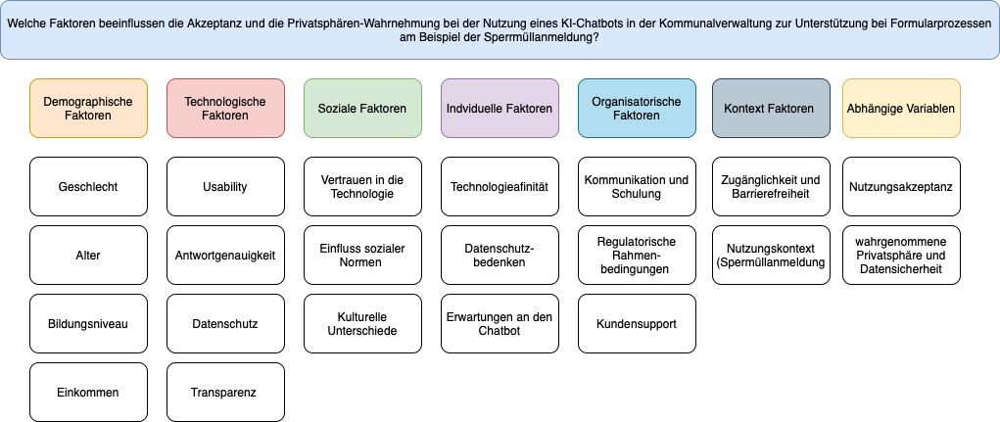

>>>>>>> 5a0641e08bfe6184dee4b9956dd19361c210da3c
# Teammitglieder

-   Emilia
-   Monique
-   Zehra
-   Elcin 

# Forschungsfrage

Welche Faktoren beeinflussen die Akzeptanz und die
Privatsphären-Wahrnehmung bei der Nutzung eines KI-Chatbots in der
Kommunalverwaltung zur Unterstützung bei Formularprozessen?

# Faktorenraum
Readme_files/Faktorenraum.jpeg

# Faktorenraum

> Gefällt mir ebenfalls sehr gut, manchmal sind die Bezugsgrößen aber etwas unklar. Ich habe Sie so verstanden, dass Sie sich auf eines der drei Szenarien fokussieren, korrekt? An welcher Stelle im Fragebogen soll das Szenario platziert werden? Der Faktor "Usability" direkt am Anfang klingt z.B. direkt nach abhängiger Variable, die man erst nach dem Szenario abfragen kann. Bitte überlegen Sie bei jedem Faktor nochmal, ob das etwas grundsätzliches ist oder etwas, was sich spezifisch auf dem Chatbot bezieht. Bei spezifischen Dingen müssen wir für den echten Fragebogen leider schauen, dass wir nicht zu viel abfragen. 

# Operationalisierung
Technikaffinität: Affinity towards technology interaction (ATI) nach [Franke et al. (2019)](10.1080/10447318.2018.1456150 "Franke, T., Attig, C., & Wessel, D. (2019). A Personal Resource for Technology Interaction: Development and Validation of the Affinity for Technology Interaction (ATI) Scale. International Journal of Human–Computer Interaction, 35(6), 456-467, DOI: 10.1080/10447318.2018.1456150")

# Hypothesen 

Einfache Zusammenhangshypothesen: 

Je höher die Technikaffinität der Nutzenden über KI, desto höher ist die Nutzungsakzeptanz.
(Pearson-Korrelation: Zwischen Technikaffinität UV und Nutzungsakzeptanz AV)

> Handwerklich super, finde ich aber sprachlich schwierig. Vielleicht eher: Es gibt einen positiven Zusammenhang zwischen Technikaffinität und Nutzungsintention?

Je höher das Alter der Nutzenden, desto höher die Datenschutzbedenken.
(Pearson-Korrelation: Zwischen Alter UV und Datenschutzbedenken AV)

> Datenschutzbedenken sind im Sinne des Fragebogens eher Privacy-Bedenken, aber Hypothese ist gut! 

Je höher das Vertrauen in die Technik, desto höher ist die Nutzungsakzeptanz.
(Pearson-Korrelation: Zwischen Vertrauen in die Technologie UV und Datenschutzbedenken AV)

> Da wir einen gemeinsamen Fragebogen erstellen, kann es sein, dass wir hieraus einen Zusammenhang zwischen Vertrauen in den Chatbot und Nutzungsintenion machen müssen. 

Komplexe Zusammenhangshypothesen: 

Je höher die usability und die wahrgenommene Datensicherheit des Chatbots sind, desto positiver ist die Privatsphären-Wahrnehmung.
(Multiple lineare Regression: Zwischen usability UV1 sowie Datensicherheit UV2 und Privatsphären-Wahrnehmung AV)

> Für Regression finde ich die Formulierung "je desto" schwierig. Über diese Hypothese sollten wir im Seminar nochmal sprechen.

Einfache Unterschiedshypothesen: 
Personen mit hoher Technikaffinität zeigen eine höhere Nutzungsakzeptanz gegenüber dem KI-Chatbot als Personen mit geringer Technikaffinität.

> Ich finde den Begriff Nutzungsakzeptanz etwas irreführend. Akzeptanz wird in den meisten Modellen als Nutzungsintention operationalisiert. Hier wäre eine Zusammenhangshypothese geeigneter. Es gibt einen positiven Zusammenhang zwischen Technikaffinität und Nutzungsintention?

Die Technikaffinität ist bei jüngeren Nutzenden höher als bei älteren Nutzenden.
(Unverbundener T-Test: Zwischen Alter UV und Technikaffinität AV)

> Handwerklich super, passt aber inhaltlich nicht zur Forschungsfrage. 

Personen die digitale Medien häufiger nutzen, haben eine höhere Akzeptanz des KI-Chatbots, als Personen die selten digitale Medien nutzen.
(Unverbundener T-Test: Zwischen Häufigkeit der Nutzung von digitalen Medien UV und Nutzungsakzeptanz AV)

> Der entsprechende Faktor fehlt im Faktorenraum, aber sonst finde ich die Hypothese spannend. 

Die Nutzungsakzeptanz ist nach der Nutzung des KI-Chatbots höher als vorher.
(Verbundener T-Test: Zwischen vorher/ nachher UV und Nutzungsakzeptanz AV)

> Vorsicht, der Fragebogen bietet uns nicht die Möglichkeit, den Chatbot wirklich zu nutzen. Wir haben kein vorher/nachher. 

Komplexe Unterschiedshypothesen:

Jüngere und technikaffine Nutzende haben eine höhere Akzeptanz und eine positivere Privatsphären-Wahrnehmung des Chatbots als ältere und technikferne Nutzende.
(F-Test MANOVA:  Zwischen Alter UV1 & Technikaffinität UV2 und Nutzungsakzeptanz AV1 & wahrgenommene Privatsphäre und Datensicherheit AV2)

> Diese Hypothese finde ich richtig stark, weil der Gruppenvergleich so spezifisch ist. Sprachlich aber bitte nochmal überarbeiten: Nutzungakzeptanz ist Nutzungsintention und das Gegenteil von technikaffin ist technikavers. 