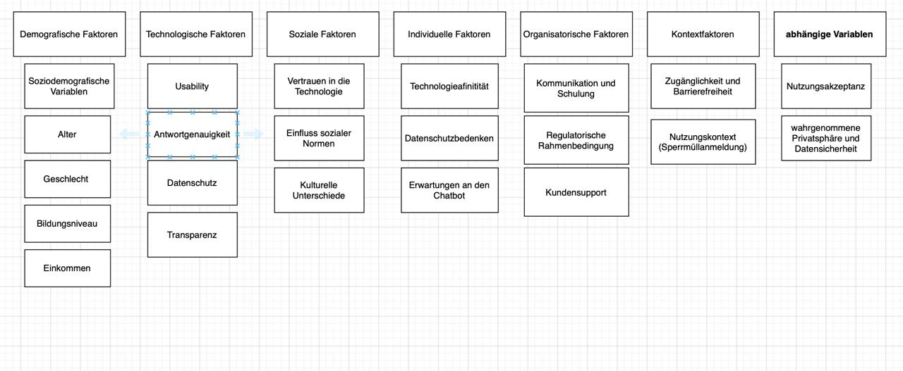

```{r include=FALSE}
library(tidyverse)
library(ggthemes)
library(AachenColorPalette)
libary(jmv)

df <- readRDS("data/data.rds")
display_aachen_colors(
libary(ggplot2)
)
```

# Akzeptanz und Privatsphäre von KI-Chatbots in der Verwaltung

## **Teammitglieder**

-   Emilia
-   Monique
-   Zehra
-   Elcin-Havva Konar

##Forschungsfrage

-   Welche Faktoren beeinflussen die Akzeptanz und die Privatsphären-Wahrnehmung bei der Nutzung eines KI-Chatbots in der Kommunalverwaltung zur Unterstützung bei Formularprozessen?

##Faktorenraum 

##Operationalisierung

-   **Technikaffinität:** Affinity towards technology interaction (ATI) nach [Franke et al. (2019)](10.1080/10447318.2018.1456150 "Franke, T., Attig, C., & Wessel, D. (2019). A Personal Resource for Technology Interaction: Development and Validation of the Affinity for Technology Interaction (ATI) Scale. International Journal of Human–Computer Interaction, 35(6), 456-467, DOI: 10.1080/10447318.2018.1456150")

-   **Alter**: Wie alt sind Sie?
    (in Jahren)

-   **Bildungsabschluss**: Was ist ihr höchster Bildungsabschluss?
    ((Noch) kein Schulabschluss Hauptschulabschluss Realschulabschluss Abitur Höher als Abitur)

-   **Nutzungsintention**: User Acceptance of Information Technology:\
    Toward a Unified View (UTAUT) Venkatesh, V., Morris, M. G., Davis, G.B., & Davis, F. D.(2003).User Acceptance of Information Technology: Toward a Unified View.MIS Quarterly, 27(3), 425–478.
    <https://doi.org/10.2307/30036540>

-   **Vertrauen**: Trust_in_Automation_Questionnaire (TiA): <https://github.com/moritzkoerber/TiA_Trust_in_Automation_Questionnaire/blob/master/Vertrauen-in-Automation_TiA_Fragebogen.pdf>

-   \*Nutzung Digitaler Medien:\*\* (Häufigkeit der Nutzung) Wie oft nutzen Sie digitale Medien?
    (nie, einmal im Monat, mehrmals im Monat, einmal pro Woche, mehrmals in der Woche, täglich)

-   **Datenschutzbedenken:** Development of measures of online privacy concern and protection for use on the Internet (IUIPC); (Buchanan, Tom & Joinson, Adam & Paine Schofield, Carina & Reips, Ulf-Dietrich. (2007).
    Development of measures of online privacy concern and protection for use on the Internet.Journal of the American Society for Information Science and Technology.
    <http://dx.doi.org/10.1002/asi.20459>)

## Altersverteilung der Stichprobe im Histogram


```{r, echo = F}
ggplot(df) +
 aes(x = Age) +
  geom_histogram(bins = 30L, fill = "#112446") +
  geom_vline(xintercept = mean(df$Age, na.rm = TRUE)) +
  geom_text(x = mean(df$Age, na.rm = TRUE), y = 20, label = paste0("M = ", round(mean(df$Age, na.rm = TRUE), 2)), angle = 90, vjust = 1.5 ) +
 labs(x = "Alter in Jahren", y = "Anzahl der Proband*innen", title = paste0("Altersverteiliung n = (", nrow(df),")"), 
 subtitle = " Histogram der Altersverteilung", caption = " 30 Bins ") +
 theme_minimal()

```

## **Hypothesen**

**Einfache Zusammenhangshypothesen:**

-   **H1:** Es gibt einen positiven Zusammenhang zwischen der Technikaffinität und digitaler Mediennutzung (Kendall-Tau: Zwischen Technikaffinität UV und Digitale Mediennutzung AV)

```{r}
cor.test(df$ATI,as.numeric(df$Mn), method = "kendall-tau")
```

-   **H2:** Je höher das Alter der Nutzenden, desto höher die Privatsphäredisposition. (Pearson-Korrelation: Zwischen Alter UV und Privatsphäredisposition AV)

```{r}
cor.test(df$Age,df$PD, method = "pearson")
```

-   **H3:** Je höher das Vertrauen in den KI-Chatbot, desto niedrieger sind die Datenschutzbedenken. (Pearson-Korrelation: Zwischen Vertrauen in die Technologie UV und Datenschutzbedenken AV)

```{r}
cor.test(df$NZV,df$PW, method = "pearson")
```

**Komplexe Zusammenhangshypothesen:**

-   **H4:** Je höher die usability und die wahrgenommene Privatsphäredisposition des Chatbots sind, desto positiver ist die Privatsphären-Wahrnehmung. (Multiple lineare Regression: Zwischen usability UV1 sowie Privatsphäredisposition UV2 und Privatsphären-Wahrnehmung AV)

**Einfache Unterschiedshypothesen:**

-   **H5:** Nutzende mit höherem Bildungsabschluss haben eine höhere Technikaffinität als Nutzende mit niedrigem Bildungsabschluss. (Unverbundener T-Test: Zwischen Bildungsniveau UV und Technikaffinität AV)

```{r}
t.test( filter(df, Bildungsabschluss > "Abitur")$ATI , filter(df, Bildungsabschluss < "Abitur")$ATI )
```

-   **H6:** Frauen haben eine höheres Empfinden der Privatsphäre bei der Nutzung eines KI-Chatbots als Männer. (Unverbundener T-Test: Zwischen Geschlecht (UV) und wahrgenommener Privatsphäre (AV)

```{r}
t.test( filter(df, Gender == "Weiblich")$PW , filter(df, Gender == "Männlich")$PW )
```

-   **H7:** Die Nutzungsintention der Stichprobe, gemessen auf einer Skala von 1-6, ist höher als 3,5. (Einfacher T-Test: Nutzungsintention (AV))

```{r}
t.test(df$BIATT,mu=3)
```

**Komplexe Unterschiedshypothesen:**

-   **H8:** Jüngere und technikaffine Nutzende haben eine höhere Nutzungsintention und eine positivere Privatsphären-Wahrnehmung des Chatbots als ältere und technikavers Nutzende. (F-Test MANOVA: Zwischen Alter UV1 & Technikaffinität UV2 und Nutzungsintention AV1 & wahrgenommene Privatsphäre und Datensicherheit AV2)

```{r}

```
