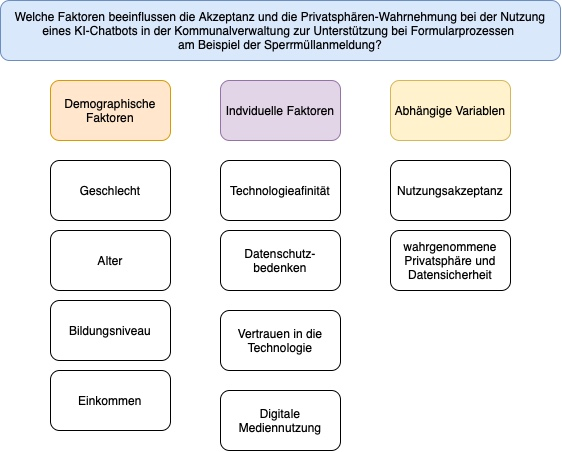

```{r include=FALSE}
library(tidyverse)
library(ggthemes)
library(AachenColorPalette)
library(jmv)
library(plotrix)

df <- readRDS("data/data.rds")
display_aachen_colors()
library(ggplot2)

```

# Akzeptanz und Privatsphäre von KI-Chatbots in der Verwaltung

## **Teammitglieder**

-   Emilia
-   Monique Beckers
-   Zehra Aksoy
-   Elcin-Havva Konar

## **Forschungsfrage**

-   Welche Faktoren beeinflussen die Akzeptanz und die Privatsphären-Wahrnehmung bei der Nutzung eines KI-Chatbots in der Kommunalverwaltung zur Unterstützung bei Formularprozessen?

Faktorenraum 

## **Operationalisierung**

-   **Technikaffinität:** Affinity towards technology interaction (ATI) nach [Franke et al. (2019)](10.1080/10447318.2018.1456150 "Franke, T., Attig, C., & Wessel, D. (2019). A Personal Resource for Technology Interaction: Development and Validation of the Affinity for Technology Interaction (ATI) Scale. International Journal of Human–Computer Interaction, 35(6), 456-467, DOI: 10.1080/10447318.2018.1456150")

-   **Alter**: Wie alt sind Sie?
    (in Jahren)

-   **Bildungsabschluss**: Was ist ihr höchster Bildungsabschluss?
    ((Noch) kein Schulabschluss Hauptschulabschluss Realschulabschluss Abitur Höher als Abitur)

-   **Nutzungsintention**: User Acceptance of Information Technology:\
    Toward a Unified View (UTAUT) Venkatesh, V., Morris, M. G., Davis, G.B., & Davis, F. D.(2003).User Acceptance of Information Technology: Toward a Unified View.MIS Quarterly, 27(3), 425–478.
    <https://doi.org/10.2307/30036540>

-   **Vertrauen**: Trust_in_Automation_Questionnaire (TiA): <https://github.com/moritzkoerber/TiA_Trust_in_Automation_Questionnaire/blob/master/Vertrauen-in-Automation_TiA_Fragebogen.pdf>

-   \*Nutzung Digitaler Medien:\*\* (Häufigkeit der Nutzung) Wie oft nutzen Sie digitale Medien?
    (nie, einmal im Monat, mehrmals im Monat, einmal pro Woche, mehrmals in der Woche, täglich)

-   **Datenschutzbedenken:** Development of measures of online privacy concern and protection for use on the Internet (IUIPC); (Buchanan, Tom & Joinson, Adam & Paine Schofield, Carina & Reips, Ulf-Dietrich. (2007).
    Development of measures of online privacy concern and protection for use on the Internet.Journal of the American Society for Information Science and Technology.
    <http://dx.doi.org/10.1002/asi.20459>)

## Altersverteilung der Stichprobe im Histogram


```{r, echo = F}
ggplot(df) +
 aes(x = Age) +
  geom_histogram(bins = 30L, fill = "#112446") +
  geom_vline(xintercept = mean(df$Age, na.rm = TRUE)) +
  geom_text(x = mean(df$Age, na.rm = TRUE), y = 20, label = paste0("M = ", round(mean(df$Age, na.rm = TRUE), 2)), angle = 90, vjust = 1.5 ) +
 labs(x = "Alter in Jahren", y = "Anzahl der Proband*innen", title = paste0("Altersverteiliung n = (", nrow(df),")"), 
 subtitle = " Histogram der Altersverteilung", caption = " 30 Bins ") +
 theme_minimal()

```


## **Hypothesen**

**Einfache Zusammenhangshypothesen:**

-   **H1:** Es gibt einen positiven Zusammenhang zwischen der Technikaffinität und digitaler Mediennutzung (Kendall-Tau: Zwischen Technikaffinität UV und Digitale Mediennutzung AV)

```{r}
cor.test(df$ATI,as.numeric(df$Mn), method = "kendall")

library(ggplot2)
library(dplyr)

ggplot(df) +

 aes(x = Age, y = Mn) +
 geom_boxplot(fill = "green") +
 labs(x = "Alter in Jahren", y = "Digitale Mediennutzung", 
 title = "Zusammenhang von Alter und Nutzung digitaler Medien") +
 theme_minimal()
```

-   **H2:** Je höher das Alter der Nutzenden, desto höher die Privatsphäredisposition. (Pearson-Korrelation: Zwischen Alter UV und Privatsphäredisposition AV)

```{r}
cor.test(df$Age,df$PD, method = "pearson")
```

```{r}
library(ggplot2)
library(dplyr)

ggplot(df) +
 aes(x = Age, y = PD) +
 geom_point(colour = "#112446") +
 labs(x = "Alter in Jahren", y = "Privatsphärenakzeptanz", 
 title = "Zusammenhang von Alter und Privatspährendisposition", subtitle = "Punktdiagramm") +
 theme_minimal()
```


-   **H3:** Je höher das Vertrauen in den KI-Chatbot, desto niedrieger sind die Datenschutzbedenken. (Pearson-Korrelation: Zwischen Vertrauen in die Technologie UV und Datenschutzbedenken AV)

```{r}
cor.test(df$NZV,df$PW, method = "pearson")

ggplot(df) +
  aes(x = NZV, y = PD)  +
  geom_point(colour = "#112446") +
  geom_smooth(method = "lm") +
  scale_x_continuous(breaks = c(1:6), limits = c(0.5,6.5)) +
  scale_y_continuous(breaks = c(1:6), limits = c(0.5, 6.5)) +
  labs(x = "Vertrauen in die Technologie ", y = "Privatsphärebedenken", 
       title = "Signifikanter Zusammenhang zwischen Vertrauen 
       in die Technologie und Privatsphärebedenken", subtitle = "Punktdiagramm mit Korrelationsgeraden") +
  theme_minimal()
```

**Komplexe Zusammenhangshypothesen:**

-   **H4:** Je höher die Technikaffinität und die wahrgenommene Privatsphäredisposition des Chatbots sind, desto positiver ist die Privatsphären-Wahrnehmung. (Multiple lineare Regression: Zwischen Technikaffinität UV1 sowie Privatsphäredisposition UV2 und Privatsphären-Wahrnehmung AV)

```{r} 
jmv::linReg(df,
            dep = c("PW"),
            covs = c("ATI", "PD"),
            blocks = c("PD", "ATI"),
            r2Adj = TRUE, stdEst = TRUE, modelTest = TRUE)

```

**Einfache Unterschiedshypothesen:**

-   **H5:** Nutzende mit höherem Bildungsabschluss haben eine höhere Technikaffinität als Nutzende mit niedrigem Bildungsabschluss. (Unverbundener T-Test: Zwischen Bildungsniveau UV und Technikaffinität AV)

```{r}
t.test( filter(df, Bildungsabschluss > "Abitur")$ATI , filter(df, Bildungsabschluss < "Abitur")$ATI )

library(ggplot2)
library(dplyr)

df_clean <- df %>% 
  filter(!is.na(Bildungsabschluss) & !is.na(ATI)) %>%
  mutate(Bildungsgruppe = case_when( 
    Bildungsabschluss >= "Abitur" ~ "Abitur oder höher", 
    Bildungsabschluss < "Abitur" ~ "Niedriger als Abitur"
  ))

df_summary <- df_clean %>%
  group_by(Bildungsgruppe) %>%
  summarise(
    mean_ATI = mean(ATI, na.rm = TRUE),
    sd_ATI = std.error(ATI, na.rm = TRUE)
  )

ggplot(df_summary, aes(x = Bildungsgruppe, y = mean_ATI)) +
  geom_bar(width = 0.5, stat = "identity", fill ="red") +
  geom_errorbar(aes(ymin = mean_ATI - sd_ATI, ymax = mean_ATI + sd_ATI), width = 0.2) +
  labs(title = "Mittelwert des ATI-Werts nach Bildungsgruppe", x = "Bildungsgruppe", y = "Mittlerer ATI-Wert") +
  theme_minimal()
```

-   **H6:** Frauen haben eine höheres Empfinden der Privatsphäre bei der Nutzung eines KI-Chatbots als Männer. (Unverbundener T-Test: Zwischen Geschlecht (UV) und wahrgenommener Privatsphäre (AV)

```{r}
t.test( filter(df, Gender == "Weiblich")$PW , filter(df, Gender == "Männlich")$PW )

df %>% 
  filter(Gender != "Divers"&Gender!= "Keine Angabe") %>%
  group_by(Gender) %>% 
  summarise(mean_cse = mean(PW)-1, sem_cse = std.error(PW)) %>%
  ggplot() +
  aes(x = Gender, fill = Gender, weight = mean_cse, ymin = mean_cse - sem_cse, ymax = mean_cse + sem_cse ) +
  geom_bar( width = 0.5) +
  scale_fill_manual(values=c("blue", "red"), guide="none") + 
  geom_errorbar(width = 0.2) +
  ylim(0,5) +
  theme_minimal() +
  labs(title = " Frauen haben eine höhere Privatsphärewahrnehmung als Männer", 
       subtitle = "Balkendiagramm: PW im Vergleich zwischen Männern und Frauen ", 
       x = "Geschlecht",
       y = "PW [0 - 5]",
       fill = "Geschlecht",
       caption = "Fehlerbalken zeigen Standardfehler des Mittelwertes") +
  NULL
```

-   **H7:** Die Nutzungsintention der Stichprobe, gemessen auf einer Skala von 1-6, ist höher als 3,5. (Einfacher T-Test: Nutzungsintention (AV))


```{r}
t.test(df$BI,mu=3.5)

library(dplyr)
library(ggplot2)

ggplot(df) +
  aes(x = BI) +
  geom_histogram(bins = 35L, fill = "red") +
  geom_vline(xintercept = 3.5 , color = "black", linetype = "dashed") +
  labs(title = "Verteilung der Nutzungsintentionen (BI)", 
       x = "Nutzungsintention (BI)", 
       y = "Häufigkeit") +
  theme_minimal()
ggsave("Hypothese_7.png", width = 6)
```

**Komplexe Unterschiedshypothesen:**

-   **H8:** Jüngere und technikaffine Nutzende haben eine höhere Nutzungsintention und eine positivere Privatsphären-Wahrnehmung des Chatbots als ältere und technikavers Nutzende. (F-Test MANOVA: Zwischen Alter UV1 & Technikaffinität UV2 und Nutzungsintention AV1 & wahrgenommene Privatsphäre und Datensicherheit AV2)
```{r}
df$altersgruppe <- cut(df$Age, labels = c("jung", "alt"), breaks = c(0, median(df$Age,na.rm = TRUE), 100))
df$atigruppe <- cut(df$ATI, labels = c("niedrig", "hoch"), breaks = c(0, median(df$ATI,na.rm = TRUE), 100))
mancova(df, deps = c("PW", "BI"), factors = c("altersgruppe", "atigruppe"), multivar = "wilks")
```

```{r}
# Altersgruppe und Technikaffinität gruppieren
df$altersgruppe <- cut(df$Age, labels = c("jung", "alt"), breaks = c(-Inf, median(df$Age, na.rm = TRUE), Inf))

df$atigruppe <- cut(df$ATI, labels = c("niedrig", "hoch"), breaks = c(-Inf, median(df$ATI, na.rm = TRUE), Inf))

# ANOVA für Nutzungseinstellung (BI)
anovaresult <- jmv::ANOVA(df, dep=BI, factors = c("altersgruppe", "atigruppe"), emmPlots = TRUE, emmTables = TRUE, 
                        emMeans =list(c("altersgruppe"),c("atigruppe"),                                                                                    c("altersgruppe", "atigruppe"),
                                                             c("atigruppe", "altersgruppe")))

anovaresult$main


# Haupteffekte und Interaktionseffekte extrahieren
haupteffekt1 <- anovaresult$emm[[1]]$emmTable$asDF  # Haupteffekt Altersgruppe
haupteffekt2 <- anovaresult$emm[[2]]$emmTable$asDF  # Haupteffekt Technikaffinität
interaktionseffekt <- anovaresult$emm[[3]]$emmTable$asDF # Interaktion Altersgruppe x Technikaffinität
interaktionseffekt2 <- anovaresult$emm[[4]]$emmTable$asDF 

# Visualisierung der Haupteffekte und Interaktionseffekte für Nutzungseinstellung (BI)
haupteffekt1 %>% 
ggplot() +
 aes(x = altersgruppe, y = mean, ymin = lower, ymax = upper) +
 geom_errorbar(width = 0.2, colour = "black") +
 geom_point() +
 theme_minimal() +
 labs(title = "Haupteffekt Altersgruppe auf Nutzungseinstellung")

haupteffekt2 %>% 
ggplot() +
 aes(x = atigruppe, y = mean, ymin = lower, ymax = upper) +
 geom_errorbar(width = 0.2, colour = "black") +
 geom_point() +
 theme_minimal() +
 labs(title = "Haupteffekt Technikaffinität auf Nutzungseinstellung")

interaktionseffekt %>% 
  ggplot() +
 aes(x = atigruppe, colour = altersgruppe, y = mean, ymin = lower, ymax = upper) +
 geom_errorbar(width = 0.2, colour = "black") +
 geom_point() +
 geom_line(aes(group = altersgruppe)) +
 theme_minimal() +
 labs(title = "Interaktionseffekt zwischen Altersgruppe und Technikaffinität auf Nutzungseinstellung",
x = "Technikaffinität",
    y = "Mittelwert der Nutzungseinstellung",
    colour = "Altersgruppe")

interaktionseffekt2 %>% 
  ggplot() +
  aes(x = atigruppe, colour = altersgruppe, y = mean, ymin = lower, ymax = upper) +
  geom_errorbar(width = 0.2, colour = "black") +
  geom_point() +
  geom_line(aes(group = altersgruppe)) +
  theme_minimal() +
  labs(
    title = "Interaktionseffekt zwischen Altersgruppe und Technikaffinität auf Privatsphären-Wahrnehmung",
    x = "Technikaffinität",
    y = "Mittelwert der Privatsphären-Wahrnehmung",
    colour = "Altersgruppe"
  )

# ANOVA für Privatsphären-Wahrnehmung (PW)
anovaresult_pw <- jmv::ANOVA(df, dep = PW, factors = c("altersgruppe", "atigruppe"), 
           emmPlots = TRUE, emmTables = TRUE, emMeans = list(c("altersgruppe"), c("atigruppe"),
                                                             c("altersgruppe", "atigruppe"),
                                                             c("atigruppe", "altersgruppe")))

# Haupteffekte und Interaktionseffekte extrahieren
haupteffekt1 <- anovaresult_pw$emm[[1]]$emmTable$asDF  # Haupteffekt Altersgruppe
haupteffekt2 <- anovaresult_pw$emm[[2]]$emmTable$asDF  # Haupteffekt Technikaffinität
interaktionseffekt <- anovaresult_pw$emm[[3]]$emmTable$asDF  # Interaktion Altersgruppe x Technikaffinität
interaktionseffekt2 <- anovaresult_pw$emm[[4]]$emmTable$asDF

# Visualisierung der Haupteffekte und Interaktionseffekte für Privatsphären-Wahrnehmung (PW)
haupteffekt1 %>% 
ggplot() +
 aes(x = altersgruppe, y = mean, ymin = lower, ymax = upper) +
 geom_errorbar(width = 0.2, colour = "black") +
 geom_point() +
 theme_minimal() +
 labs(title = "Haupteffekt Altersgruppe auf Privatsphären-Wahrnehmung")

haupteffekt2 %>% 
ggplot() +
 aes(x = atigruppe, y = mean, ymin = lower, ymax = upper) +
 geom_errorbar(width = 0.2, colour = "black") +
 geom_point() +
 theme_minimal() +
 labs(title = "Haupteffekt Technikaffinität auf PW")
```


