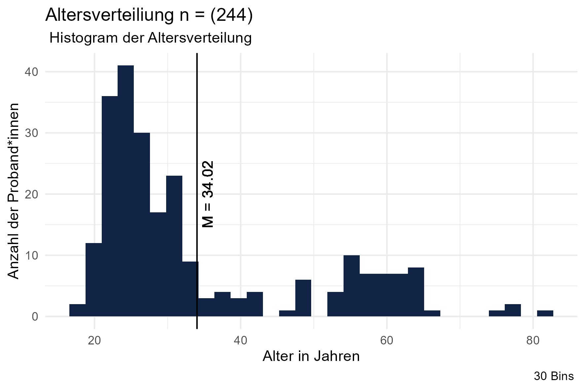

# Akzeptanz und Privatsphäre von KI-Chatbots in der Verwaltung

## **Teammitglieder**

-   Emilia Momot
-   Monique Beckers
-   Zehra
-   Elcin-Havva Konar

\##Forschungsfrage

-   Welche Faktoren beeinflussen die Akzeptanz und die
    Privatsphären-Wahrnehmung bei der Nutzung eines KI-Chatbots in der
    Kommunalverwaltung zur Unterstützung bei Formularprozessen?

\##Faktorenraum 

\##Operationalisierung

-   **Technikaffinität:** Affinity towards technology interaction (ATI)
    nach [Franke et
    al. (2019)](10.1080/10447318.2018.1456150 "Franke, T., Attig, C., & Wessel, D. (2019). A Personal Resource for Technology Interaction: Development and Validation of the Affinity for Technology Interaction (ATI) Scale. International Journal of Human–Computer Interaction, 35(6), 456-467, DOI: 10.1080/10447318.2018.1456150")

-   **Alter**: Wie alt sind Sie? (in Jahren)

-   **Bildungsabschluss**: Was ist ihr höchster Bildungsabschluss?
    ((Noch) kein Schulabschluss Hauptschulabschluss Realschulabschluss
    Abitur Höher als Abitur)

-   **Nutzungsintention**: User Acceptance of Information Technology:  
    Toward a Unified View (UTAUT) Venkatesh, V., Morris, M. G., Davis,
    G.B., & Davis, F. D.(2003).User Acceptance of Information
    Technology: Toward a Unified View.MIS Quarterly, 27(3), 425–478.
    <https://doi.org/10.2307/30036540>

-   **Vertrauen**: Trust\_in\_Automation\_Questionnaire (TiA):
    <https://github.com/moritzkoerber/TiA_Trust_in_Automation_Questionnaire/blob/master/Vertrauen-in-Automation_TiA_Fragebogen.pdf>

-   \*Nutzung Digitaler Medien:\*\* (Häufigkeit der Nutzung) Wie oft
    nutzen Sie digitale Medien? (nie, einmal im Monat, mehrmals im
    Monat, einmal pro Woche, mehrmals in der Woche, täglich)

-   **Datenschutzbedenken:** Development of measures of online privacy
    concern and protection for use on the Internet (IUIPC); (Buchanan,
    Tom & Joinson, Adam & Paine Schofield, Carina & Reips, Ulf-Dietrich.
    (2007). Development of measures of online privacy concern and
    protection for use on the Internet.Journal of the American Society
    for Information Science and Technology.
    <http://dx.doi.org/10.1002/asi.20459>)

## Altersverteilung der Stichprobe im Histogram

## **Hypothesen**

**Einfache Zusammenhangshypothesen:**

-   **H1:** Es gibt einen positiven Zusammenhang zwischen der
    Technikaffinität und digitaler Mediennutzung (Kendall-Tau: Zwischen
    Technikaffinität UV und Digitale Mediennutzung AV)

<!-- -->

    cor.test(df$ATI,as.numeric(df$Mn), method = "kendall")

    ## 
    ##  Kendall's rank correlation tau
    ## 
    ## data:  df$ATI and as.numeric(df$Mn)
    ## z = 1.6133, p-value = 0.1067
    ## alternative hypothesis: true tau is not equal to 0
    ## sample estimates:
    ##        tau 
    ## 0.08768496
    
    

-   **H2:** Je höher das Alter der Nutzenden, desto höher die
    Privatsphäredisposition. (Pearson-Korrelation: Zwischen Alter UV und
    Privatsphäredisposition AV)
  

<!-- -->

    cor.test(df$Age,df$PD, method = "pearson")

    ## 
    ##  Pearson's product-moment correlation
    ## 
    ## data:  df$Age and df$PD
    ## t = -2.4801, df = 226, p-value = 0.01386
    ## alternative hypothesis: true correlation is not equal to 0
    ## 95 percent confidence interval:
    ##  -0.28663885 -0.03355924
    ## sample estimates:
    ##        cor 
    ## -0.1627752

-   **H3:** Je höher das Vertrauen in den KI-Chatbot, desto niedrieger
    sind die Datenschutzbedenken. (Pearson-Korrelation: Zwischen
    Vertrauen in die Technologie UV und Datenschutzbedenken AV)

    cor.test(df$NZV,df$PW, method = "pearson")

    ## 
    ##  Pearson's product-moment correlation
    ## 
    ## data:  df$NZV and df$PW
    ## t = 2.4559, df = 227, p-value = 0.01481
    ## alternative hypothesis: true correlation is not equal to 0
    ## 95 percent confidence interval:
    ##  0.0319030 0.2845845
    ## sample estimates:
    ##       cor 
    ## 0.1608788

**Komplexe Zusammenhangshypothesen:**

-   **H4:** Je höher die usability und die wahrgenommene
    Privatsphäredisposition des Chatbots sind, desto positiver ist die
    Privatsphären-Wahrnehmung. (Multiple lineare Regression: Zwischen
    usability UV1 sowie Privatsphäredisposition UV2 und
    Privatsphären-Wahrnehmung AV)

**Einfache Unterschiedshypothesen:**

-   **H5:** Nutzende mit höherem Bildungsabschluss haben eine höhere
    Technikaffinität als Nutzende mit niedrigem Bildungsabschluss.
    (Unverbundener T-Test: Zwischen Bildungsniveau UV und
    Technikaffinität AV)

    t.test( filter(df, Bildungsabschluss > "Abitur")$ATI , filter(df, Bildungsabschluss < "Abitur")$ATI )

    ## 
    ##  Welch Two Sample t-test
    ## 
    ## data:  filter(df, Bildungsabschluss > "Abitur")$ATI and filter(df, Bildungsabschluss < "Abitur")$ATI
    ## t = 1.5055, df = 100.29, p-value = 0.1354
    ## alternative hypothesis: true difference in means is not equal to 0
    ## 95 percent confidence interval:
    ##  -0.07883191  0.57492558
    ## sample estimates:
    ## mean of x mean of y 
    ##  3.678307  3.430260

-   **H6:** Frauen haben eine höheres Empfinden der Privatsphäre bei der
    Nutzung eines KI-Chatbots als Männer. (Unverbundener T-Test:
    Zwischen Geschlecht (UV) und wahrgenommener Privatsphäre (AV)

    t.test( filter(df, Gender == "Weiblich")$PW , filter(df, Gender == "Männlich")$PW )

    ## 
    ##  Welch Two Sample t-test
    ## 
    ## data:  filter(df, Gender == "Weiblich")$PW and filter(df, Gender == "Männlich")$PW
    ## t = 0.57994, df = 196.51, p-value = 0.5626
    ## alternative hypothesis: true difference in means is not equal to 0
    ## 95 percent confidence interval:
    ##  -0.231673  0.424690
    ## sample estimates:
    ## mean of x mean of y 
    ##  3.479487  3.382979

-   **H7:** Die Nutzungsintention der Stichprobe, gemessen auf einer
    Skala von 1-6, ist höher als 3,5. (Einfacher T-Test:
    Nutzungsintention (AV))

<!-- -->

    t.test(df$BI,mu=3)

    ## 
    ##  One Sample t-test
    ## 
    ## data:  df$BI
    ## t = 12.413, df = 228, p-value < 2.2e-16
    ## alternative hypothesis: true mean is not equal to 3
    ## 95 percent confidence interval:
    ##  3.837592 4.153674
    ## sample estimates:
    ## mean of x 
    ##  3.995633

**Komplexe Unterschiedshypothesen:**

-   **H8:** Jüngere und technikaffine Nutzende haben eine höhere
    Nutzungsintention und eine positivere Privatsphären-Wahrnehmung des
    Chatbots als ältere und technikavers Nutzende. (F-Test MANOVA:
    Zwischen Alter UV1 & Technikaffinität UV2 und Nutzungsintention AV1
    & wahrgenommene Privatsphäre und Datensicherheit AV2)
