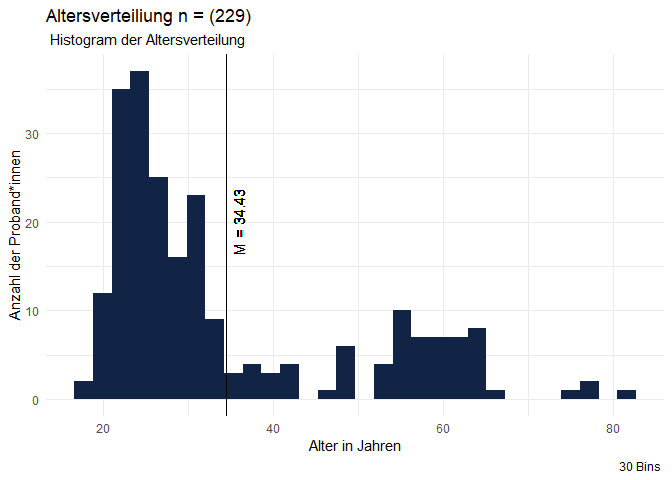
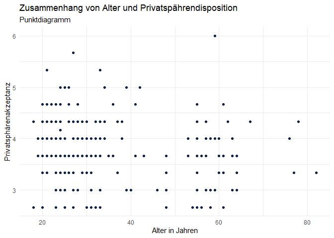
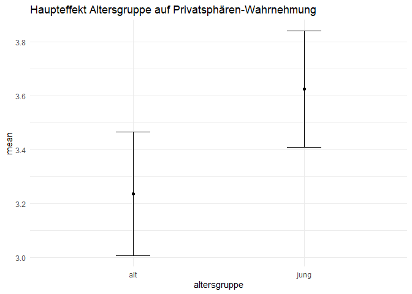

# Akzeptanz und Privatsphäre von KI-Chatbots in der Verwaltung

## **Teammitglieder**

-   Emilia
-   Monique Beckers
-   Zehra Aksoy
-   Elcin-Havva Konar

## **Forschungsfrage**

-   Welche Faktoren beeinflussen die Akzeptanz und die
    Privatsphären-Wahrnehmung bei der Nutzung eines KI-Chatbots in der
    Kommunalverwaltung zur Unterstützung bei Formularprozessen?

Faktorenraum 

## **Operationalisierung**

-   **Technikaffinität:** Affinity towards technology interaction (ATI)
    nach [Franke et
    al. (2019)](10.1080/10447318.2018.1456150 "Franke, T., Attig, C., & Wessel, D. (2019). A Personal Resource for Technology Interaction: Development and Validation of the Affinity for Technology Interaction (ATI) Scale. International Journal of Human–Computer Interaction, 35(6), 456-467, DOI: 10.1080/10447318.2018.1456150")

-   **Alter**: Wie alt sind Sie? (in Jahren)

-   **Bildungsabschluss**: Was ist ihr höchster Bildungsabschluss?
    ((Noch) kein Schulabschluss Hauptschulabschluss Realschulabschluss
    Abitur Höher als Abitur)

-   **Nutzungsintention**: User Acceptance of Information Technology:  
    Toward a Unified View (UTAUT) Venkatesh, V., Morris, M. G., Davis,
    G.B., & Davis, F. D.(2003).User Acceptance of Information
    Technology: Toward a Unified View.MIS Quarterly, 27(3), 425–478.
    <https://doi.org/10.2307/30036540>

-   **Vertrauen**: Trust\_in\_Automation\_Questionnaire (TiA):
    <https://github.com/moritzkoerber/TiA_Trust_in_Automation_Questionnaire/blob/master/Vertrauen-in-Automation_TiA_Fragebogen.pdf>

-   \*Nutzung Digitaler Medien:\*\* (Häufigkeit der Nutzung) Wie oft
    nutzen Sie digitale Medien? (nie, einmal im Monat, mehrmals im
    Monat, einmal pro Woche, mehrmals in der Woche, täglich)

-   **Datenschutzbedenken:** Development of measures of online privacy
    concern and protection for use on the Internet (IUIPC); (Buchanan,
    Tom & Joinson, Adam & Paine Schofield, Carina & Reips, Ulf-Dietrich.
    (2007). Development of measures of online privacy concern and
    protection for use on the Internet.Journal of the American Society
    for Information Science and Technology.
    <http://dx.doi.org/10.1002/asi.20459>)

## Altersverteilung der Stichprobe im Histogram

    ## Warning: Removed 1 row containing non-finite outside the scale range
    ## (`stat_bin()`).

## **Hypothesen**

**Einfache Zusammenhangshypothesen:**

-   **H1:** Es gibt einen positiven Zusammenhang zwischen der
    Technikaffinität und digitaler Mediennutzung (Kendall-Tau: Zwischen
    Technikaffinität UV und Digitale Mediennutzung AV)

<!-- -->

    cor.test(df$ATI,as.numeric(df$Mn), method = "kendall")

    ## 
    ##  Kendall's rank correlation tau
    ## 
    ## data:  df$ATI and as.numeric(df$Mn)
    ## z = 1.6133, p-value = 0.1067
    ## alternative hypothesis: true tau is not equal to 0
    ## sample estimates:
    ##        tau 
    ## 0.08768496

    library(ggplot2)
    library(dplyr)

    ggplot(df) +

     aes(x = Age, y = Mn) +
     geom_boxplot(fill = "green") +
     labs(x = "Alter in Jahren", y = "Digitale Mediennutzung", 
     title = "Zusammenhang von Alter und Nutzung digitaler Medien") +
     theme_minimal()

    ## Warning: Removed 1 row containing non-finite outside the scale range
    ## (`stat_boxplot()`).

-   **H2:** Je höher das Alter der Nutzenden, desto höher die
    Privatsphäredisposition. (Pearson-Korrelation: Zwischen Alter UV und
    Privatsphäredisposition AV)

<!-- -->

    cor.test(df$Age,df$PD, method = "pearson")

    ## 
    ##  Pearson's product-moment correlation
    ## 
    ## data:  df$Age and df$PD
    ## t = -2.4801, df = 226, p-value = 0.01386
    ## alternative hypothesis: true correlation is not equal to 0
    ## 95 percent confidence interval:
    ##  -0.28663885 -0.03355924
    ## sample estimates:
    ##        cor 
    ## -0.1627752

    library(ggplot2)
    library(dplyr)

    ggplot(df) +
     aes(x = Age, y = PD) +
     geom_point(colour = "#112446") +
     labs(x = "Alter in Jahren", y = "Privatsphärenakzeptanz", 
     title = "Zusammenhang von Alter und Privatspährendisposition", subtitle = "Punktdiagramm") +
     theme_minimal()

    ## Warning: Removed 1 row containing missing values or values outside the scale range
    ## (`geom_point()`).

-   **H3:** Je höher das Vertrauen in den KI-Chatbot, desto niedrieger
    sind die Datenschutzbedenken. (Pearson-Korrelation: Zwischen
    Vertrauen in die Technologie UV und Datenschutzbedenken AV)

<!-- -->

    cor.test(df$NZV,df$PW, method = "pearson")

    ## 
    ##  Pearson's product-moment correlation
    ## 
    ## data:  df$NZV and df$PW
    ## t = 2.4559, df = 227, p-value = 0.01481
    ## alternative hypothesis: true correlation is not equal to 0
    ## 95 percent confidence interval:
    ##  0.0319030 0.2845845
    ## sample estimates:
    ##       cor 
    ## 0.1608788

    ggplot(df) +
      aes(x = NZV, y = PD)  +
      geom_point(colour = "#112446") +
      geom_smooth(method = "lm") +
      scale_x_continuous(breaks = c(1:6), limits = c(0.5,6.5)) +
      scale_y_continuous(breaks = c(1:6), limits = c(0.5, 6.5)) +
      labs(x = "Vertrauen in die Technologie ", y = "Privatsphärebedenken", 
           title = "Signifikanter Zusammenhang zwischen Vertrauen 
           in die Technologie und Privatsphärebedenken", subtitle = "Punktdiagramm mit Korrelationsgeraden") +
      theme_minimal()

    ## `geom_smooth()` using formula = 'y ~ x'

**Komplexe Zusammenhangshypothesen:**

-   **H4:** Je höher die Technikaffinität und die wahrgenommene
    Privatsphäredisposition des Chatbots sind, desto positiver ist die
    Privatsphären-Wahrnehmung. (Multiple lineare Regression: Zwischen
    Technikaffinität UV1 sowie Privatsphäredisposition UV2 und
    Privatsphären-Wahrnehmung AV)

<!-- -->

    jmv::linReg(df,
                dep = c("PW"),
                covs = c("ATI", "PD"),
                blocks = c("PD", "ATI"),
                r2Adj = TRUE, stdEst = TRUE, modelTest = TRUE)

    ## 
    ##  LINEAR REGRESSION
    ## 
    ##  Model Fit Measures                                                                         
    ##  ────────────────────────────────────────────────────────────────────────────────────────── 
    ##    Model    R            R²            Adjusted R²    F           df1    df2    p           
    ##  ────────────────────────────────────────────────────────────────────────────────────────── 
    ##        1    0.3037914    0.09228921     0.08829049    23.07965      1    227    0.0000028   
    ##        2    0.3543818    0.12558644     0.11784827    16.22947      2    226    0.0000003   
    ##  ────────────────────────────────────────────────────────────────────────────────────────── 
    ##    Note. Models estimated using sample size of N=229
    ## 
    ## 
    ##  Model Comparisons                                                            
    ##  ──────────────────────────────────────────────────────────────────────────── 
    ##    Model         Model    ΔR²           F           df1    df2    p           
    ##  ──────────────────────────────────────────────────────────────────────────── 
    ##        1    -        2    0.03329723    8.605967      1    226    0.0036958   
    ##  ──────────────────────────────────────────────────────────────────────────── 
    ## 
    ## 
    ##  MODEL SPECIFIC RESULTS
    ## 
    ##  MODEL 1
    ## 
    ##  Model Coefficients - PW                                                             
    ##  ─────────────────────────────────────────────────────────────────────────────────── 
    ##    Predictor    Estimate     SE           t           p            Stand. Estimate   
    ##  ─────────────────────────────────────────────────────────────────────────────────── 
    ##    Intercept    1.2356964    0.4659660    2.651902    0.0085684                      
    ##    PD           0.5838278    0.1215263    4.804129    0.0000028          0.3037914   
    ##  ─────────────────────────────────────────────────────────────────────────────────── 
    ## 
    ## 
    ##  MODEL 2
    ## 
    ##  Model Coefficients - PW                                                               
    ##  ───────────────────────────────────────────────────────────────────────────────────── 
    ##    Predictor    Estimate     SE            t            p            Stand. Estimate   
    ##  ───────────────────────────────────────────────────────────────────────────────────── 
    ##    Intercept    0.1764154    0.58349690    0.3023416    0.7626697                      
    ##    PD           0.6489005    0.12158070    5.3371996    0.0000002          0.3376516   
    ##    ATI          0.2268107    0.07731499    2.9335928    0.0036958          0.1855903   
    ##  ─────────────────────────────────────────────────────────────────────────────────────

**Einfache Unterschiedshypothesen:**

-   **H5:** Nutzende mit höherem Bildungsabschluss haben eine höhere
    Technikaffinität als Nutzende mit niedrigem Bildungsabschluss.
    (Unverbundener T-Test: Zwischen Bildungsniveau UV und
    Technikaffinität AV)

<!-- -->

    t.test( filter(df, Bildungsabschluss > "Abitur")$ATI , filter(df, Bildungsabschluss < "Abitur")$ATI )

    ## 
    ##  Welch Two Sample t-test
    ## 
    ## data:  filter(df, Bildungsabschluss > "Abitur")$ATI and filter(df, Bildungsabschluss < "Abitur")$ATI
    ## t = 1.5055, df = 100.29, p-value = 0.1354
    ## alternative hypothesis: true difference in means is not equal to 0
    ## 95 percent confidence interval:
    ##  -0.07883191  0.57492558
    ## sample estimates:
    ## mean of x mean of y 
    ##  3.678307  3.430260

    library(ggplot2)
    library(dplyr)

    df_clean <- df %>% 
      filter(!is.na(Bildungsabschluss) & !is.na(ATI)) %>%
      mutate(Bildungsgruppe = case_when( 
        Bildungsabschluss >= "Abitur" ~ "Abitur oder höher", 
        Bildungsabschluss < "Abitur" ~ "Niedriger als Abitur"
      ))

    df_summary <- df_clean %>%
      group_by(Bildungsgruppe) %>%
      summarise(
        mean_ATI = mean(ATI, na.rm = TRUE),
        sd_ATI = std.error(ATI, na.rm = TRUE)
      )

    ggplot(df_summary, aes(x = Bildungsgruppe, y = mean_ATI)) +
      geom_bar(width = 0.5, stat = "identity", fill ="red") +
      geom_errorbar(aes(ymin = mean_ATI - sd_ATI, ymax = mean_ATI + sd_ATI), width = 0.2) +
      labs(title = "Mittelwert des ATI-Werts nach Bildungsgruppe", x = "Bildungsgruppe", y = "Mittlerer ATI-Wert") +
      theme_minimal()

-   **H6:** Frauen haben eine höheres Empfinden der Privatsphäre bei der
    Nutzung eines KI-Chatbots als Männer. (Unverbundener T-Test:
    Zwischen Geschlecht (UV) und wahrgenommener Privatsphäre (AV)

<!-- -->

    t.test( filter(df, Gender == "Weiblich")$PW , filter(df, Gender == "Männlich")$PW )

    ## 
    ##  Welch Two Sample t-test
    ## 
    ## data:  filter(df, Gender == "Weiblich")$PW and filter(df, Gender == "Männlich")$PW
    ## t = 0.57994, df = 196.51, p-value = 0.5626
    ## alternative hypothesis: true difference in means is not equal to 0
    ## 95 percent confidence interval:
    ##  -0.231673  0.424690
    ## sample estimates:
    ## mean of x mean of y 
    ##  3.479487  3.382979

    df %>% 
      filter(Gender != "Divers"&Gender!= "Keine Angabe") %>%
      group_by(Gender) %>% 
      summarise(mean_cse = mean(PW)-1, sem_cse = std.error(PW)) %>%
      ggplot() +
      aes(x = Gender, fill = Gender, weight = mean_cse, ymin = mean_cse - sem_cse, ymax = mean_cse + sem_cse ) +
      geom_bar( width = 0.5) +
      scale_fill_manual(values=c("blue", "red"), guide="none") + 
      geom_errorbar(width = 0.2) +
      ylim(0,5) +
      theme_minimal() +
      labs(title = " Frauen haben eine höhere Privatsphärewahrnehmung als Männer", 
           subtitle = "Balkendiagramm: PW im Vergleich zwischen Männern und Frauen ", 
           x = "Geschlecht",
           y = "PW [0 - 5]",
           fill = "Geschlecht",
           caption = "Fehlerbalken zeigen Standardfehler des Mittelwertes") +
      NULL

-   **H7:** Die Nutzungsintention der Stichprobe, gemessen auf einer
    Skala von 1-6, ist höher als 3,5. (Einfacher T-Test:
    Nutzungsintention (AV))

<!-- -->

    t.test(df$BI,mu=3.5)

    ## 
    ##  One Sample t-test
    ## 
    ## data:  df$BI
    ## t = 6.1795, df = 228, p-value = 2.931e-09
    ## alternative hypothesis: true mean is not equal to 3.5
    ## 95 percent confidence interval:
    ##  3.837592 4.153674
    ## sample estimates:
    ## mean of x 
    ##  3.995633

    library(dplyr)
    library(ggplot2)

    ggplot(df) +
      aes(x = BI) +
      geom_histogram(bins = 35L, fill = "red") +
      geom_vline(xintercept = 3.5 , color = "black", linetype = "dashed") +
      labs(title = "Verteilung der Nutzungsintentionen (BI)", 
           x = "Nutzungsintention (BI)", 
           y = "Häufigkeit") +
      theme_minimal()

    ggsave("Hypothese_7.png", width = 6)

    ## Saving 6 x 5 in image

**Komplexe Unterschiedshypothesen:**

-   **H8:** Jüngere und technikaffine Nutzende haben eine höhere
    Nutzungsintention und eine positivere Privatsphären-Wahrnehmung des
    Chatbots als ältere und technikavers Nutzende. (F-Test MANOVA:
    Zwischen Alter UV1 & Technikaffinität UV2 und Nutzungsintention AV1
    & wahrgenommene Privatsphäre und Datensicherheit AV2)

<!-- -->

    df$altersgruppe <- cut(df$Age, labels = c("jung", "alt"), breaks = c(0, median(df$Age,na.rm = TRUE), 100))
    df$atigruppe <- cut(df$ATI, labels = c("niedrig", "hoch"), breaks = c(0, median(df$ATI,na.rm = TRUE), 100))
    mancova(df, deps = c("PW", "BI"), factors = c("altersgruppe", "atigruppe"), multivar = "wilks")

    ## 
    ##  MANCOVA
    ## 
    ##  Multivariate Tests                                                                              
    ##  ─────────────────────────────────────────────────────────────────────────────────────────────── 
    ##                                               value        F           df1    df2    p           
    ##  ─────────────────────────────────────────────────────────────────────────────────────────────── 
    ##    altersgruppe              Wilks' Lambda    0.9754154    2.810271      2    223    0.0623221   
    ##    atigruppe                 Wilks' Lambda    0.9681549    3.667521      2    223    0.0270926   
    ##    altersgruppe:atigruppe    Wilks' Lambda    0.9891320    1.225096      2    223    0.2956987   
    ##  ─────────────────────────────────────────────────────────────────────────────────────────────── 
    ## 
    ## 
    ##  Univariate Tests                                                                                                   
    ##  ────────────────────────────────────────────────────────────────────────────────────────────────────────────────── 
    ##                              Dependent Variable    Sum of Squares    df     Mean Square    F            p           
    ##  ────────────────────────────────────────────────────────────────────────────────────────────────────────────────── 
    ##    altersgruppe              PW                         7.9313555      1      7.9313555    5.4897007    0.0200052   
    ##                              BI                         0.2875607      1      0.2875607    0.2003383    0.6548804   
    ##    atigruppe                 PW                         2.2205585      1      2.2205585    1.5369632    0.2163676   
    ##                              BI                        10.4297163      1     10.4297163    7.2661933    0.0075597   
    ##    altersgruppe:atigruppe    PW                         0.5158797      1      0.5158797    0.3570670    0.5507433   
    ##                              BI                         3.5285780      1      3.5285780    2.4582960    0.1183171   
    ##    Residuals                 PW                       323.6285026    224      1.4447701                             
    ##                              BI                       321.5241255    224      1.4353756                             
    ##  ──────────────────────────────────────────────────────────────────────────────────────────────────────────────────

    # Altersgruppe und Technikaffinität gruppieren
    df$altersgruppe <- cut(df$Age, labels = c("jung", "alt"), breaks = c(-Inf, median(df$Age, na.rm = TRUE), Inf))

    df$atigruppe <- cut(df$ATI, labels = c("niedrig", "hoch"), breaks = c(-Inf, median(df$ATI, na.rm = TRUE), Inf))

    # ANOVA für Nutzungseinstellung (BI)
    anovaresult <- jmv::ANOVA(df, dep=BI, factors = c("altersgruppe", "atigruppe"), emmPlots = TRUE, emmTables = TRUE, 
                            emMeans =list(c("altersgruppe"),c("atigruppe"),                                                                                    c("altersgruppe", "atigruppe"),
                                                                 c("atigruppe", "altersgruppe")))

    anovaresult$main

    ## 
    ##  ANOVA - BI                                                                                   
    ##  ──────────────────────────────────────────────────────────────────────────────────────────── 
    ##                              Sum of Squares    df     Mean Square    F            p           
    ##  ──────────────────────────────────────────────────────────────────────────────────────────── 
    ##    altersgruppe                   0.5950046      1      0.5950046    0.4145289    0.5203384   
    ##    atigruppe                     11.1248576      1     11.1248576    7.7504856    0.0058288   
    ##    altersgruppe:atigruppe         3.5285780      1      3.5285780    2.4582960    0.1183171   
    ##    Residuals                    321.5241255    224      1.4353756                             
    ##  ────────────────────────────────────────────────────────────────────────────────────────────

    # Haupteffekte und Interaktionseffekte extrahieren
    haupteffekt1 <- anovaresult$emm[[1]]$emmTable$asDF  # Haupteffekt Altersgruppe
    haupteffekt2 <- anovaresult$emm[[2]]$emmTable$asDF  # Haupteffekt Technikaffinität
    interaktionseffekt <- anovaresult$emm[[3]]$emmTable$asDF # Interaktion Altersgruppe x Technikaffinität
    interaktionseffekt2 <- anovaresult$emm[[4]]$emmTable$asDF 

    # Visualisierung der Haupteffekte und Interaktionseffekte für Nutzungseinstellung (BI)
    haupteffekt1 %>% 
    ggplot() +
     aes(x = altersgruppe, y = mean, ymin = lower, ymax = upper) +
     geom_errorbar(width = 0.2, colour = "black") +
     geom_point() +
     theme_minimal() +
     labs(title = "Haupteffekt Altersgruppe auf Nutzungseinstellung")

    haupteffekt2 %>% 
    ggplot() +
     aes(x = atigruppe, y = mean, ymin = lower, ymax = upper) +
     geom_errorbar(width = 0.2, colour = "black") +
     geom_point() +
     theme_minimal() +
     labs(title = "Haupteffekt Technikaffinität auf Nutzungseinstellung")

    interaktionseffekt %>% 
      ggplot() +
     aes(x = atigruppe, colour = altersgruppe, y = mean, ymin = lower, ymax = upper) +
     geom_errorbar(width = 0.2, colour = "black") +
     geom_point() +
     geom_line(aes(group = altersgruppe)) +
     theme_minimal() +
     labs(title = "Interaktionseffekt zwischen Altersgruppe und Technikaffinität auf Nutzungseinstellung",
    x = "Technikaffinität",
        y = "Mittelwert der Nutzungseinstellung",
        colour = "Altersgruppe")

    interaktionseffekt2 %>% 
      ggplot() +
      aes(x = atigruppe, colour = altersgruppe, y = mean, ymin = lower, ymax = upper) +
      geom_errorbar(width = 0.2, colour = "black") +
      geom_point() +
      geom_line(aes(group = altersgruppe)) +
      theme_minimal() +
      labs(
        title = "Interaktionseffekt zwischen Altersgruppe und Technikaffinität auf Privatsphären-Wahrnehmung",
        x = "Technikaffinität",
        y = "Mittelwert der Privatsphären-Wahrnehmung",
        colour = "Altersgruppe"
      )

    # ANOVA für Privatsphären-Wahrnehmung (PW)
    anovaresult_pw <- jmv::ANOVA(df, dep = PW, factors = c("altersgruppe", "atigruppe"), 
               emmPlots = TRUE, emmTables = TRUE, emMeans = list(c("altersgruppe"), c("atigruppe"),
                                                                 c("altersgruppe", "atigruppe"),
                                                                 c("atigruppe", "altersgruppe")))

    # Haupteffekte und Interaktionseffekte extrahieren
    haupteffekt1 <- anovaresult_pw$emm[[1]]$emmTable$asDF  # Haupteffekt Altersgruppe
    haupteffekt2 <- anovaresult_pw$emm[[2]]$emmTable$asDF  # Haupteffekt Technikaffinität
    interaktionseffekt <- anovaresult_pw$emm[[3]]$emmTable$asDF  # Interaktion Altersgruppe x Technikaffinität
    interaktionseffekt2 <- anovaresult_pw$emm[[4]]$emmTable$asDF

    # Visualisierung der Haupteffekte und Interaktionseffekte für Privatsphären-Wahrnehmung (PW)
    haupteffekt1 %>% 
    ggplot() +
     aes(x = altersgruppe, y = mean, ymin = lower, ymax = upper) +
     geom_errorbar(width = 0.2, colour = "black") +
     geom_point() +
     theme_minimal() +
     labs(title = "Haupteffekt Altersgruppe auf Privatsphären-Wahrnehmung")

    haupteffekt2 %>% 
    ggplot() +
     aes(x = atigruppe, y = mean, ymin = lower, ymax = upper) +
     geom_errorbar(width = 0.2, colour = "black") +
     geom_point() +
     theme_minimal() +
     labs(title = "Haupteffekt Technikaffinität auf PW")

